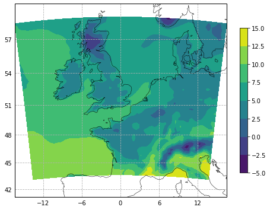
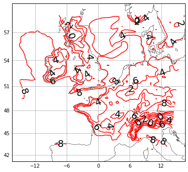
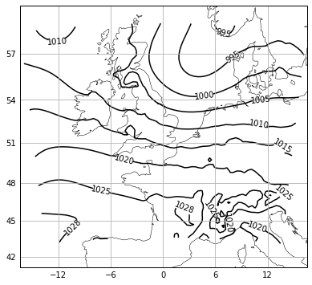
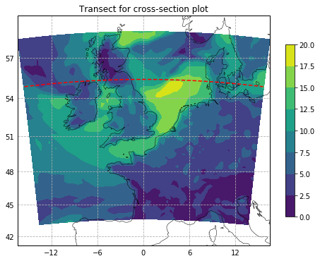
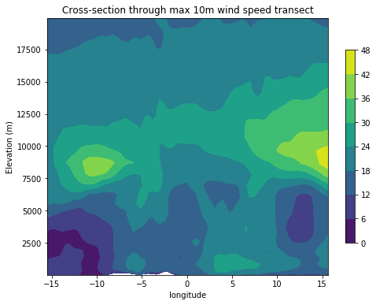

# Weather-Forecast


```python
import numpy as np
import xarray as xr

import cartopy.crs as ccrs
import cartopy.feature as cfeature

import matplotlib.pyplot as plt
%matplotlib inline
```


```python
WRFdat = xr.open_dataset('/Users/daniel/wrfout.nc')
```


```python
WRFdat
```


<pre>&lt;xarray.Dataset&gt;
Dimensions:                (Time: 25, bottom_top: 32, bottom_top_stag: 33, seed_dim_stag: 8, soil_layers_stag: 4, south_north: 60, south_north_stag: 61, west_east: 73, west_east_stag: 74)
Coordinates:
    XLAT                   (Time, south_north, west_east) float32 ...
    XLONG                  (Time, south_north, west_east) float32 ...
    XTIME                  (Time) datetime64[ns] ...
    XLAT_U                 (Time, south_north, west_east_stag) float32 ...
    XLONG_U                (Time, south_north, west_east_stag) float32 ...
    XLAT_V                 (Time, south_north_stag, west_east) float32 ...
    XLONG_V                (Time, south_north_stag, west_east) float32 ...
Dimensions without coordinates: Time, bottom_top, bottom_top_stag, seed_dim_stag, soil_layers_stag, south_north, south_north_stag, west_east, west_east_stag
Data variables:
    Times                  (Time) |S19 ...
    LU_INDEX               (Time, south_north, west_east) float32 ...
    ZNU                    (Time, bottom_top) float32 ...
    ZNW                    (Time, bottom_top_stag) float32 ...
    ZS                     (Time, soil_layers_stag) float32 ...
    DZS                    (Time, soil_layers_stag) float32 ...
    VAR_SSO                (Time, south_north, west_east) float32 ...
    U                      (Time, bottom_top, south_north, west_east_stag) float32 ...
    V                      (Time, bottom_top, south_north_stag, west_east) float32 ...
    W                      (Time, bottom_top_stag, south_north, west_east) float32 ...
    PH                     (Time, bottom_top_stag, south_north, west_east) float32 ...
    PHB                    (Time, bottom_top_stag, south_north, west_east) float32 ...
    T                      (Time, bottom_top, south_north, west_east) float32 ...
    MAX_MSTFX              (Time) float32 ...
    MAX_MSTFY              (Time) float32 ...
    RAINC                  (Time, south_north, west_east) float32 ...
    RAINSH                 (Time, south_north, west_east) float32 ...
    RAINNC                 (Time, south_north, west_east) float32 ...
    SNOWNC                 (Time, south_north, west_east) float32 ...
    GRAUPELNC              (Time, south_north, west_east) float32 ...
    HAILNC                 (Time, south_north, west_east) float32 ...
    CLDFRA                 (Time, bottom_top, south_north, west_east) float32 ...
    SWDOWN                 (Time, south_north, west_east) float32 ...
    GLW                    (Time, south_north, west_east) float32 ...
    SWNORM                 (Time, south_north, west_east) float32 ...

Attributes:
    TITLE:                            OUTPUT FROM WRF V4.1.4 MODEL
    START_DATE:                      2020-03-13_00:00:00
    SIMULATION_START_DATE:           2020-03-13_00:00:00
    WEST-EAST_GRID_DIMENSION:        74
    SOUTH-NORTH_GRID_DIMENSION:      61
    BOTTOM-TOP_GRID_DIMENSION:       33
    DX:                              30000.0
    DY:                              30000.0
    AERCU_OPT:                       0
    AERCU_FCT:                       1.0
    IDEAL_CASE:                      0
    DIFF_6TH_SLOPEOPT:               0
    AUTO_LEVELS_OPT:                 2
    DIFF_6TH_THRESH:                 0.1
    DZBOT:                           50.0
    DZSTRETCH_S:                     1.3
    DZSTRETCH_U:                     1.1
    SKEBS_ON:                        0
    SPEC_BDY_FINAL_MU:               1
    USE_Q_DIABATIC:                  0
    GRIDTYPE:                        C
    DIFF_OPT:                        1
    KM_OPT:                          4
    DAMP_OPT:                        3
    DAMPCOEF:                        0.2
    KHDIF:                           0.0
    KVDIF:                           0.0
    MP_PHYSICS:                      8
    RA_LW_PHYSICS:                   4
    RA_SW_PHYSICS:                   4
    SF_SFCLAY_PHYSICS:               2
    SF_SURFACE_PHYSICS:              2
    BL_PBL_PHYSICS:                  2
    CU_PHYSICS:                      6
    SF_LAKE_PHYSICS:                 0
    SURFACE_INPUT_SOURCE:            3
    SST_UPDATE:                      0
    GRID_FDDA:                       0
    GFDDA_INTERVAL_M:                0
    GFDDA_END_H:                     0
    GRID_SFDDA:                      0
    SGFDDA_INTERVAL_M:               0
    SGFDDA_END_H:                    0
    HYPSOMETRIC_OPT:                 2
    USE_THETA_M:                     1
    GWD_OPT:                         1
    SF_URBAN_PHYSICS:                0
    SF_SURFACE_MOSAIC:               0
    SF_OCEAN_PHYSICS:                0
    SHCU_PHYSICS:                    0
    MFSHCONV:                        0
    FEEDBACK:                        1
    SMOOTH_OPTION:                   0
    SWRAD_SCAT:                      1.0
    W_DAMPING:                       0
    DT:                              180.0
    RADT:                            30.0
    BLDT:                            0.0
    CUDT:                            5.0
    AER_OPT:                         0
    SWINT_OPT:                       0
    AER_TYPE:                        1
    AER_AOD550_OPT:                  1
    AER_ANGEXP_OPT:                  1
    AER_SSA_OPT:                     1
    AER_ASY_OPT:                     1
    AER_AOD550_VAL:                  0.12
    AER_ANGEXP_VAL:                  1.3
    AER_SSA_VAL:                     0.85
    AER_ASY_VAL:                     0.9
    MOIST_ADV_OPT:                   1
    SCALAR_ADV_OPT:                  1
    TKE_ADV_OPT:                     1
    DIFF_6TH_OPT:                    0
    DIFF_6TH_FACTOR:                 0.12
    OBS_NUDGE_OPT:                   0
    BUCKET_MM:                       -1.0
    BUCKET_J:                        -1.0
    PREC_ACC_DT:                     0.0
    ISFTCFLX:                        0
    ISHALLOW:                        0
    ISFFLX:                          1
    ICLOUD:                          1
    ICLOUD_CU:                       0
    TRACER_PBLMIX:                   1
    SCALAR_PBLMIX:                   0
    YSU_TOPDOWN_PBLMIX:              0
    GRAV_SETTLING:                   0
    DFI_OPT:                         0
    SIMULATION_INITIALIZATION_TYPE:  REAL-DATA CASE
    WEST-EAST_PATCH_START_UNSTAG:    1
    WEST-EAST_PATCH_END_UNSTAG:      73
    WEST-EAST_PATCH_START_STAG:      1
    WEST-EAST_PATCH_END_STAG:        74
    SOUTH-NORTH_PATCH_START_UNSTAG:  1
    SOUTH-NORTH_PATCH_END_UNSTAG:    60
    SOUTH-NORTH_PATCH_START_STAG:    1
    SOUTH-NORTH_PATCH_END_STAG:      61
    BOTTOM-TOP_PATCH_START_UNSTAG:   1
    BOTTOM-TOP_PATCH_END_UNSTAG:     32
    BOTTOM-TOP_PATCH_START_STAG:     1
    BOTTOM-TOP_PATCH_END_STAG:       33
    GRID_ID:                         1
    PARENT_ID:                       0
    I_PARENT_START:                  1
    J_PARENT_START:                  1
    PARENT_GRID_RATIO:               1
    CEN_LAT:                         51.50298
    CEN_LON:                         0.05529785
    TRUELAT1:                        46.50298
    TRUELAT2:                        5.0553
    MOAD_CEN_LAT:                    51.50298
    STAND_LON:                       0.0553
    POLE_LAT:                        90.0
    POLE_LON:                        0.0
    GMT:                             0.0
    JULYR:                           2020
    JULDAY:                          73
    MAP_PROJ:                        1
    MAP_PROJ_CHAR:                   Lambert Conformal
    MMINLU:                          MODIFIED_IGBP_MODIS_NOAH
    NUM_LAND_CAT:                    21
    ISWATER:                         17
    ISLAKE:                          21
    ISICE:                           15
    ISURBAN:                         13
    ISOILWATER:                      14
    HYBRID_OPT:                      2
    ETAC:                            0.2</pre>


```python
WRFdat.T2
# Look at the dimensions of the wind variable 'U' and 'V'
# Do we notice anything different?
# How does this relate to our earlier discussion about different types of grids?
```


<pre>&lt;xarray.DataArray &#x27;T2&#x27; (Time: 25, south_north: 60, west_east: 73)&gt;
[109500 values with dtype=float32]
Coordinates:
    XLAT     (Time, south_north, west_east) float32 ...
    XLONG    (Time, south_north, west_east) float32 ...
    XTIME    (Time) datetime64[ns] ...
Dimensions without coordinates: Time, south_north, west_east
Attributes:
    FieldType:    104
    MemoryOrder:  XY 
    description:  TEMP at 2 M
    units:        K
    stagger:      </pre>


```python
t2m = WRFdat.T2[0,:,:]
lons = WRFdat.XLONG[0,:,:]
lats = WRFdat.XLAT[0,:,:]
```


```python
WRFdat.U
# The difference we notice is that instead of memory order XY, we have XYZ, meaning that we record the wind
# at a certain altitude as well

# This relates to the discussion about different types of grids in that....
```


<pre>&lt;xarray.DataArray &#x27;U&#x27; (Time: 25, bottom_top: 32, south_north: 60, west_east_stag: 74)&gt;
[3552000 values with dtype=float32]
Coordinates:
    XTIME    (Time) datetime64[ns] ...
    XLAT_U   (Time, south_north, west_east_stag) float32 ...
    XLONG_U  (Time, south_north, west_east_stag) float32 ...
Dimensions without coordinates: Time, bottom_top, south_north, west_east_stag
Attributes:
    FieldType:    104
    MemoryOrder:  XYZ
    description:  x-wind component
    units:        m s-1
    stagger:      X</pre>


```python
fig = plt.figure(figsize=[8,6])
ax = plt.axes(projection=ccrs.Mercator())

ax.coastlines(resolution='50m', color='black',linewidth=0.5)

ax.set_extent([lons.values.min(),lons.values.max(), lats.values.min()-2, lats.values.max()])

cf = ax.contourf(lons, lats, t2m-273.15, transform=ccrs.PlateCarree())

plt.colorbar(cf, shrink=0.75)

grd = ax.gridlines(draw_labels=True, linestyle='--')
grd.xlabels_top=False
grd.ylabels_right=False
    
```


    

    


```python
fig = plt.figure(figsize=[8,6])
ax = plt.axes(projection=ccrs.Mercator())

ax.coastlines(resolution='50m',color='black',linewidth=0.5)

ax.set_extent([lons.values.min(),lons.values.max(), lats.values.min()-2, lats.values.max()])
            
t_cl = ax.contour(lons,lats,t2m-273.15,np.array([-2,0,2,4,6,8]),
                 colors='red',linestyles='-',transform=ccrs.PlateCarree())

plt.clabel(t_cl,inline=1,fontsize=20,fmt='%1.0f',inline_spacing=1,colors='black')

#grd = ax.gridlines(draw_labels=True,linestlye='--')
# Weird error here, why do we have to take out linestyle?
grd = ax.gridlines(draw_labels=True)
grd.xlabels_top = False
grd.ylabels_right = False
```


    

    


```python
# Advanced plots 1

# First we define our variables
# In doing so we choose the hour in which we take our data from, we choose 0 for the first hour of the day
t2m = WRFdat.T2[0,:,:]   # 2-metre temperature
z = WRFdat.HGT[0,:,:]    # height above sea level of the ground
surfp = WRFdat.PSFC[0,:,:]  # atmospheric pressure at the ground
```


```python
surft = t2m + (6.5*z/1000)  # create 'surft' variable representing atmospheric pressure (where)...?
mslp = surfp*np.exp(9.81/(287.0*surft)*z)*0.01 + (6.7*z/ 1000)   
# The MSLP variable is the Mean Sea Level Pressure variable which is used to show
# regions of low and high pressure
```


```python
fig = plt.figure(figsize=[8,6])   # What do these mean
ax = plt.axes(projection=ccrs.Mercator())

ax.coastlines(resolution='50m',color='black',linewidth=0.5)  # meaning?

ax.set_extent([lons.values.min(),lons.values.max(), lats.values.min()-2, lats.values.max()])

mslp_cl = ax.contour(lons,lats,mslp,np.array([990,995,1000,1005,1010,1015,1020,1025,1028,1030,1035]),
                 colors='black',linestyles='-',transform=ccrs.PlateCarree())

plt.clabel(mslp_cl,inline=1,fontsize=10,fmt='%1.0f',inline_spacing=1,colors='black')

#grd = ax.gridlines(draw_labels=True,linestlye='--')
# Weird error here, why do we have to take out linestyle?
grd = ax.gridlines(draw_labels=True)
grd.xlabels_top = False
grd.ylabels_right = False
```


    

    


```python
# Advanced plots 2

# First we define our variables
U = WRFdat.U10[0,:,:]
V = WRFdat.V10[0,:,:]

Wind_speed = np.sqrt(U**2 +V**2)

# Calculate area of max windspeed
iwsmx, jwsmx = np.unravel_index(Wind_speed.argmax(), Wind_speed.shape)
# iwsmx is the row the max value takes in the array and jwsmx is the column
# By running this code we avoid flatten the array, find the max and then put the array back together to find the index of the max value
# np.where(Wind_speed==np.amax(Wind_speed))
```


```python
fig = plt.figure(figsize=[8,6])
ax = plt.axes(projection=ccrs.Mercator())

ax.coastlines(resolution='50m', color='black',linewidth=0.5)

ax.set_extent([lons.values.min(),lons.values.max(), lats.values.min()-2, lats.values.max()])

NAMEnow = ax.contourf(lons, lats, Wind_speed, transform=ccrs.PlateCarree())  # What does PlateCarree do?

plt.plot(lons[iwsmx,:], lats[jwsmx,:], 'r--', transform=ccrs.PlateCarree())
# How does the above work because its variable about latitude too?

plt.colorbar(NAMEnow,shrink=0.75, cmap='jet')  #why doesn't jet work here?

grd = ax.gridlines(draw_labels=True, linestyle='--')
grd.xlabels_top=False
grd.ylabels_right=False

plt.title("Transect for cross-section plot")
```


    Text(0.5, 1.0, 'Transect for cross-section plot')


    

    


```python
# Advanced plots 3

# Defining variables 
# First we note that wind speeds are calculated at staggered grids
# We must calculate wind speed variables that are 'unstaggered'
u = WRFdat.U[0,:,:]
v = WRFdat.V[0,:,:]
um = 0.5*(u[:,:,:-1] + u[:,:,1:])
vm = 0.5*(v[:,:-1,:] + v[:,1:,:])

# um and vm variavles represent the wind speed in the middle of each cell, so all values are stored in the same place now

ph = WRFdat.PH[0,:,:,:]       # These two variables proxy height
phb = WRFdat.PHB[0,:,:,:]

ApproxElev = 0.5*(phb[:-1,:,:]+ph[:-1,:,:]+phb[1:,:,:]+ph[1:,:,:])/9.81

# How do we incorporate the max wind speed values in..

#Now calculating the absolute value of the wind speeds
m = np.sqrt(um.values**2 + vm.values**2)

# new lons array which has matching dimensions
lons_new = np.tile(lons[iwsmx,:], (32,1))
```


```python
fig = plt.figure(figsize=[8,6])
ax = plt.axes()

cf_three = ax.contourf(lons_new, ApproxElev[:,iwsmx,:], m[:,iwsmx,:])

plt.colorbar(cf_three,shrink=0.75)  

# Label axis
plt.title("Cross-section through max 10m wind speed transect")
plt.xlabel("longitude")
plt.ylabel("Elevation (m)")
```


    Text(0, 0.5, 'Elevation (m)')


    

